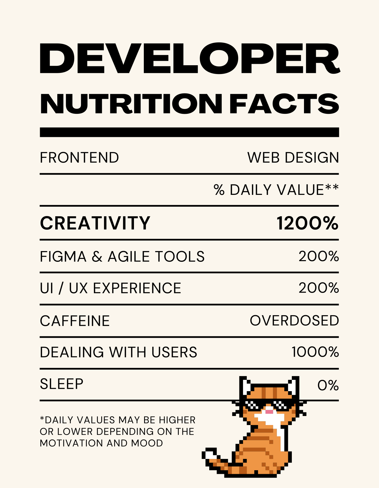

# Bienvenid@ a mi perfil de Github!
Apasionada por el desarrollo de software y el diseño web. 

Aquí encontrarás algunos de mis proyectos y colaboraciones.

## Sobre mí 🧑‍💻

- 🔭 Actualmente finalizando mi formación en Desarrollo de Aplicaciones Web.
- 📫 Cómo contactarme: [sabela.cobelo7@gmail.com](mailto:sabela.cobelo7@gmail.com).

## Tecnologías y Herramientas 🛠️

### **Lenguajes de Programación**
- 🟨 **JavaScript**: Desarrollo frontend y backend.
- ☕ **Java**: Desarrollo de aplicaciones empresariales.
- 🐘 **PHP**: Desarrollo web y backend.

### **Frameworks y Librerías**
- ⚛️ **React**: Desarrollo de interfaces de usuario interactivas.
- 🟦 **Node.js**: Desarrollo backend con JavaScript.
- 🎨 **Tailwind CSS**: Framework CSS para diseño rápido.
- 🅱️ **Bootstrap**: Framework CSS para diseño responsive.

### **Bases de Datos**
- 🐬 **MySQL**: Bases de datos relacionales.
- 🍃 **MongoDB**: Bases de datos NoSQL.
- 🔥 **Firebase**: Desarrollo de aplicaciones en tiempo real.

### **Herramientas de Desarrollo**
- 🎨 **Figma**: Diseño de interfaces de usuario.
- 🐙 **Git**: Control de versiones.
- 🖥️ **VS Code**: Editor de código ligero y potente.

### **Sistemas Operativos**
- 🪟 **Windows**: Desarrollo en entornos Windows.
- 🍏 **macOS**: Desarrollo en entornos macOS.
- 🐧 **Linux**: Entorno de desarrollo y servidores.

### **Otras Tecnologías**
- 🚀 **Agile**: Metodología ágil para desarrollo de software.
- 🔄 **Scrum**: Framework ágil para gestión de proyectos.
- 📋 **Trello**: Gestión de proyectos y tareas.
- 🗂️ **Jira**: Gestión ágil de proyectos.

 

## Proyectos Destacados 🚀

Aquí, algunos de los proyectos en los que he trabajado:

  
  

  
  

## Estadísticas de GitHub 📊

## Mi CV 📄

Si deseas conocer más sobre mi experiencia y habilidades, puedes descargar mi currículum en PDF:

- [Descargar mi currículum](CV.pdf)

- [LinkedIn](https://www.linkedin.com/in/sabelacl/)

¡Gracias por visitar mi perfil! Espero que encuentres algo interesante aquí. 😊

> "El software es una combinación de arte y lógica." - Anónimo
